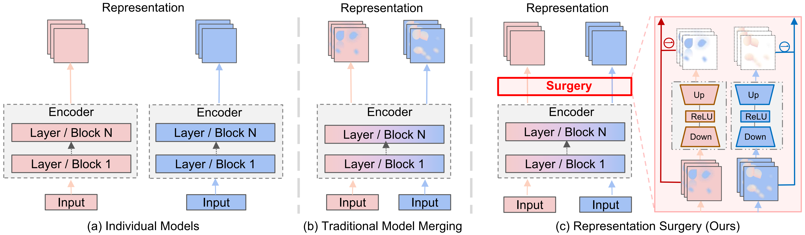

# RepresentationSurgery
A repository of **'[Representation Surgery for Multi-Task Model Merging](https://arxiv.org/pdf/2402.02705.pdf). Arxiv, 2024.'**.

## Abstract
> Multi-task learning (MTL) compresses the information from multiple tasks into a unified backbone to improve computational efficiency and generalization. Recent work directly merges multiple independently trained models to perform MTL instead of collecting their raw data for joint training, greatly expanding the application scenarios of MTL. However, by visualizing the representation distribution of existing model merging schemes, we find that the merged model often suffers from the dilemma of *representation bias*. That is, there is a significant discrepancy in the representation distribution between the merged and individual models, resulting in poor performance of merged MTL. In this paper, we propose a *representation surgery* solution called ``Surgery" to reduce representation bias in the merged model. Specifically, Surgery is a lightweight task-specific module that takes the representation of the merged model as input and attempts to output the biases contained in the representation from the merged model. We then designed an unsupervised optimization objective that updates the Surgery module by minimizing the distance between the merged model's representation and the individual model's representation. Extensive experiments demonstrate significant MTL performance improvements when our Surgery module is applied to state-of-the-art (SOTA) model merging schemes.

<center>

</center>

## Citation
If you find our paper or this resource helpful, please consider cite:
```
@article{RepresentationSurgery_Arxiv_2024,
  title={Representation Surgery for Multi-Task Model Merging},
  author={Yang, Enneng and Shen, Li and Wang, Zhenyi and Guo, Guibing and Chen, Xiaojun and Wang, Xingwei and Tao, Dacheng},
  journal={arXiv preprint arXiv:2402.02705},
  year={2024}
}
```
Thanks!

## Datasets
Refer to dataset processing in the [task_vectors](https://github.com/mlfoundations/task_vectors).

Or you can download the processed data from [Baidu Cloud disk](https://pan.baidu.com/s/1w0Z2UVv3NVmqDhjH8WTOJQ?pwd=kvg6) or [HugggingFace](https://huggingface.co/collections/tanganke/image-classification-datasets-662abda7d75efe6b0e6b43da).


## Task Vectors / Checkpoints

You can download the fine-tuned checkpoints from the [task_vectors#checkpoints](https://github.com/mlfoundations/task_vectors#checkpoints).
The Google Drive folder is: [task_vectors_checkpoints](https://drive.google.com/drive/folders/1u_Tva6x0p6oxu5Eo0ZZsf-520Cc_3MKw)


*Note: When using ```torch.load(xxx_checkpoint).state_dict()``` fails, you can try ```pickle.load(open(xxx_checkpoint, 'rb')).state_dict()```.*


## Train
Weight Averaging + Our Surgery
```
python src/main_WeightAveraging_with_surgery.py
```

Task Arithmetic + Our Surgery
```
python src/main_TaskArithmetic_with_surgery.py
```

Ties-Merging + Our Surgery
```
python src/main_TiesMerging_with_surgery.py
```

AdaMerging + Our Surgery
```
python src/main_AdaMerging_with_surgery.py
```


AdaMerging + Our Surgery (*Online setting, i.e., Batch_size=1; Each sample is only passed once.*)
```
python src/main_AdaMerging_with_surgery_online.py
```


***The logs of our experiments are in 'src/logs/'.***

*Note: By increasing the rank of the Surgery module (i.e., lines 75 and 76 in the [merging_model.py](https://github.com/EnnengYang/RepresentationSurgery/blob/main/src/merging_model.py)), you can get even better performance.*

## Acknowledgement
Our implementation references the code below, thanks to them.

- AdaMerging: https://github.com/EnnengYang/AdaMerging

- Task Arithmetic: https://github.com/mlfoundations/task_vectors

- TIES-MERGING: https://github.com/prateeky2806/ties-merging/tree/main

- Model Soups: https://github.com/mlfoundations/model-soups
